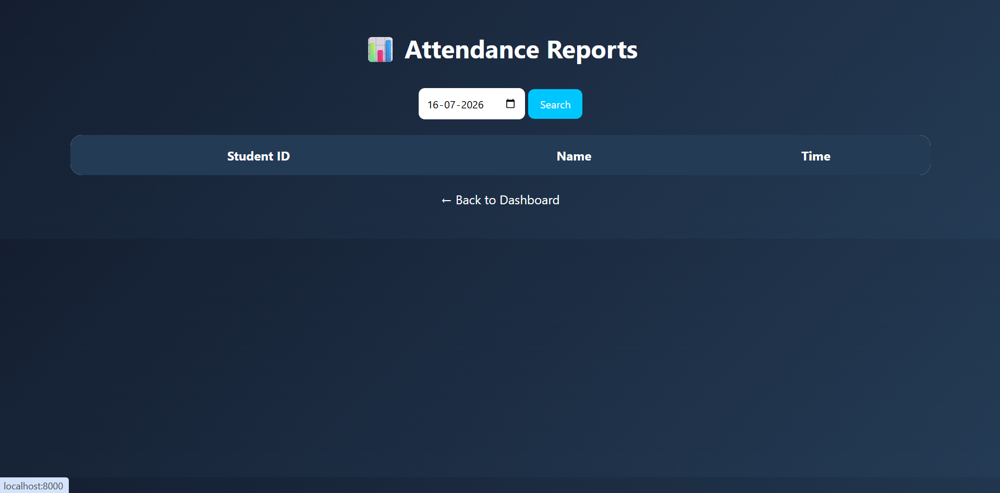

# FaceTrack AI 

## Smart Face Recognition Attendance Management System

FaceTrack AI is an AI-powered attendance management system that uses **face recognition technology** to automatically identify students and mark attendance. The system is built using **Python, Flask, and OpenCV** with a user-friendly web interface.

## Features

✅ Student Enrollment  
✅ Face Capture using Webcam  
✅ Face Detection using Haar Cascade  
✅ Face Recognition using LBPH Algorithm  
✅ Automated Attendance Marking  
✅ Attendance Records Management  
✅ Attendance Reports  
✅ Modern Dashboard Interface  

## Technologies Used

- **Programming Language:** Python
- **Framework:** Flask
- **Computer Vision:** OpenCV
- **Face Recognition Algorithm:** LBPH (Local Binary Pattern Histogram)
- **Libraries:** NumPy
- **Frontend:** HTML, CSS
- **Data Storage:** CSV

## Project Structure

```text
FaceTrack-AI/
│
├── Face Recognition Attendance System.py
├── haarcascade_frontalface_default.xml
│
├── templates/
│   ├── index.html
│   ├── register.html
│   ├── train.html
│   ├── attendance.html
│   └── view_attendance.html
│
├── static/
│
├── README.md
├── requirements.txt
└── .gitignore
```

## Installation

### 1. Clone the Repository

```bash
git clone https://github.com/dnyaneshwari2309/FaceTrack-AI.git
```

### 2. Navigate to Project Directory

```bash
cd FaceTrack-AI
```

### 3. Install Required Libraries

```bash
pip install -r requirements.txt
```

or

```bash
pip install flask opencv-contrib-python numpy
```

### 4. Run the Application

```bash
python "Face Recognition Attendance System.py"
```

The application will start running on your local server.

## How It Works

1. Register student details.
2. Capture face images using webcam.
3. Train the face recognition model.
4. Start face recognition.
5. System automatically marks attendance.
6. View attendance reports through the dashboard.

## Screenshots

### Dashboard


### Student Registration


### Attendance Report

```

## Requirements

```text
Flask
opencv-contrib-python
numpy
```

## .gitignore

```text
__pycache__/
*.pyc
venv/
trainer/
Attendance/
dataset/
```

The following files are ignored:

- Training data
- Generated face recognition models
- Attendance records
- Virtual environment files

## Future Enhancements

- MySQL database integration
- Cloud deployment
- Real-time attendance notifications
- Multiple camera support
- Deep learning based face recognition

## Author

**Dnyaneshwari Sonawane**

B.E. Artificial Intelligence & Data Science
